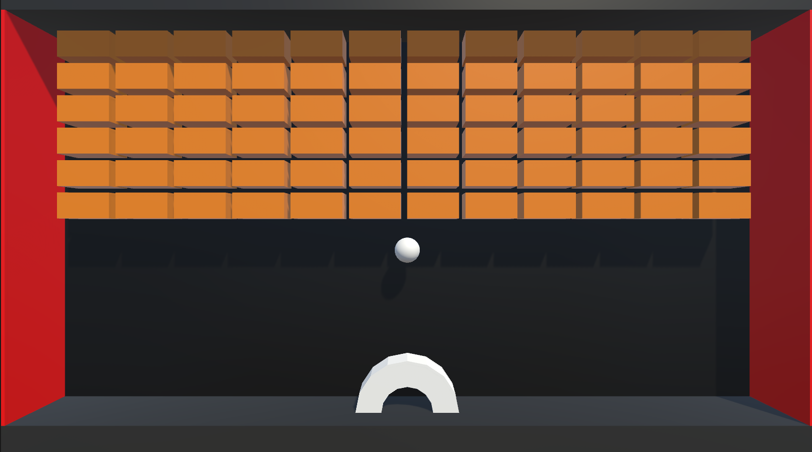
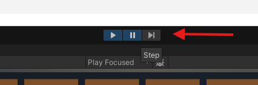
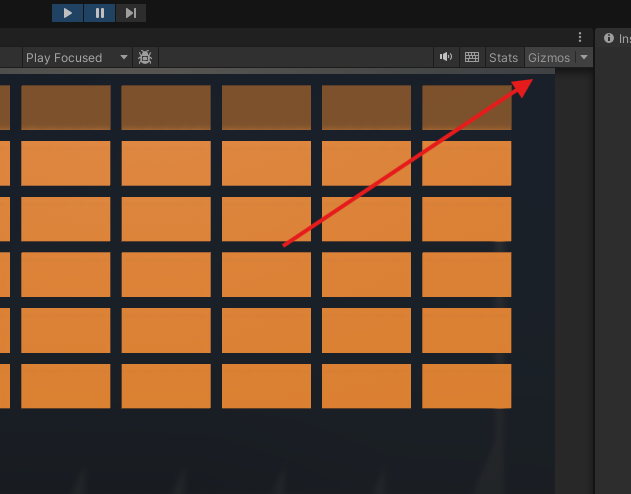
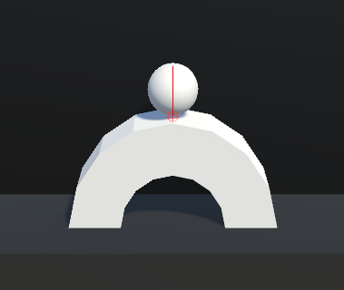

# COMP2160 Game Development – Prac Week 10

## Topics covered:
* Update and FixedUpdate (In-Depth)
* Collisions (In-Depth)
* Gizmos

## Today's Task
In this practical, you will be building a break-out style game to better explore the interactions of the physics engine in Unity, including the way FixedUpdate and Collision events operate. Much like last week, the emphasis is on the technical prototype, but this time with a game at the end.

This practical assumes you have completed the Week 9 practical, so please complete that before trying out this one.

You can check out an implementation [here](https://uncanny-machines.itch.io/comp2160-week-10-prac).



### The project
The framework provided today gives you a completed scene with no physics or scripts active (including rigidbodies). Materials as well as a PlayerActions InputActionAsset has been created. The PlayerActions takes a single input: an Axis mapped to A and D. You can think of this as a "1D Vector", in that rather than returning x and y values with -1 to 1, it simply returns a single value.

Your job is going to involve adding some interactivity and dynamics to the game, but that's really only a small part. Before we do that, we want to get more familiar with the Unity physics engine.

Acquaint yourself with the way the project is set up, then move on to Step 1.

## Step 1 – Update vs FixedUpdate (10 minutes)
We've spoken a lot with you about the differences between Update and FixedUpdate, but we're yet to dive deep into how they work differently. As stated in the [Unity documentation](https://docs.unity3d.com/ScriptReference/MonoBehaviour.FixedUpdate.html), FixedUpdate is framerate independent, which makes it useful for handling physics calculations. It is important to note however that Update and FixedUpdate do not typically coincide with one another. Failure to note this can result in some unexpected behaviour when trying to translate between the two.

To observe this, create a new script called `UpdateObserver`. Add in a `FixedUpdate()` method. Inside both the `Update()` and the `FixedUpdate()` methods. Create two integer variables, `updateCount` and `fixedUpdateCount` and have them increase by 1 inside their respective methods. Then, in either Update or FixedUpdate, add code to print how many Updates and how many FixedUpdates have passed since hitting play:

```
Debug.Log(string.Format("{0} / {1}", updateCount, fixedUpdateCount));
```

Attach this script to an object in your game and hit Play. After a few seconds, Pause the game and look at your Console. What are you noitcing about the Update and FixedUpdate runs? What happens if you step-through the game rather than hitting play again?

Make some notes on your observations. What else could you add to your Debugging to learn more?

## Step 2 - Observing Collisions (30 minutes)
Let's move onto understanding Collisions. There are three Collision events that we need to understand: [`OnCollisionEnter()`](https://docs.unity3d.com/ScriptReference/Collider.OnCollisionEnter.html),[`OnCollisionStay()`](https://docs.unity3d.com/ScriptReference/Collider.OnCollisionStay.html) and [`OnCollisionExit()`](https://docs.unity3d.com/ScriptReference/Collider.OnCollisionExit.html). You might think you know all about them based on the name, but let's get under the skin of what each of these do.

First, add rigidbodies to both the Ball object and the Player object. Then, create a new script for the Ball object. And add the three Collision methods mentioned above (read the docs if you're unsure of paramaters).

For each of these events, we want to print that our ball has either just collided with, is colliding with, or has stopped colliding with, a particular object. Add in Debug log messages that reflect this. For instance, your `OnCollisionEnter()` method might look like this:

```
void OnCollisionEnter(Collision other)
{
    Debug.Log(string.Format("Ball has collided with {0}",other.gameObject.name));
}
```

Now, step through your project by first pressing the Pause button, then the Play button, and then stepping through frame by frame by pressing the Step button at the top of the screen: 



What do you notice about the Collision events, and when they are called as compared to what you see on screen? Note down your observations.

## Step 4 - Add Gizmos (20 minutes)
Debug logging is great, but we often want to use particular debugging graphics to observe what is happening in our scene. We can achieve this by creating Gizmos.

We want to visualise the contact points (all points on colliders involved in the collision) whenever our ball hits something. This is a little different to how it is handled in 2D (as per the lecture), so make sure you follow along carefully.

### Getting the contacts

First, we'll need some variables to store the contact points and track how many there are:

```
private ContactPoint[] contacts = new ContactPoint[100]; // Array of contact points to store the contacts
private int nContacts = 0; // Number of contact points
```

So that we can keep tracking the ContactPoints each frame as they evolve (such as when one collider is sliding against another), we will get the contacts in OnCollisionStay, storing the contacts in the Contacts array and setting nContacts to the amount:

```
void OnCollisionStay(Collision other)
{
    nContacts = other.GetContacts(contacts);
    Debug.Log(string.Format("Ball is colliding with {0}",other.gameObject.name));
}
```

We then want to set nContacts back to 0 in OnCollisionExit, to stop us from drawing contacts that no longer count. Go ahead and do this now (hint: instead of writing the same code twice, could you place this in its own method?).

### Drawing the gizmos
To draw gizmos, we need to add an OnDrawGizmos() method to our script. This method is called whenever Gizmos are turned on, so will allow us to toggle them on and off in our Game view. We also want to set the Gizmos color before drawing anything. For my example, I've gone with red:

```
void OnDrawGizmos()
{
    Gizmos.color = Color.red;
}
```

Let's draw a small sphere at each contact point, by adding the following code to OnDrawGizmos():

```
for (int i = 0; i < nContacts; i++)
    {
        Vector3 p = contacts[i].point;
        Gizmos.DrawWireSphere(p, 0.1f);
    }
```

Run your game now (stepping through again) and observe the contact points when collision happens. If you can't see anything, make sure you've turned Gizmos on:



Viewing the contact points is great, but there is more info we can get. Let's also try viewing the normal of each contact point by adding the following code to our the for loop in `OnDrawGizmos()`:

```
Vector3 n = contacts[i].normal;
Gizmos.DrawLine(p, p + n);
```

Again, run your game and observe this. You should see something like this:



A problem you've likely noticed is that the Gizmos don't get drawn when Collision happens, only the frame afterwards (which in some cases is after the ball seems to have already bounced off whatever it hit!). This behaviour is easier to observe by zooming in on the object in the Scene view, or by setting the camera to Orthographic. What does this tell us about when collision events occur? What problems could this cause? Write down your ideas.

## Checkpoint! Save, commit and push your work now

### To receive half marks for today, show your demonstrator:
* Your debug logs for Update and FixedUpdate.
* Your debug logs for Collision events.
* Your gizmos showing contact points and normals.
* Any observations you've noted down.

## Step 4 - Add Player movement (20 minutes)
Now, add some rigidbody movement for the player, allowing them to move left and right when pressing A and D. As stated, the InputActionAsset has already been created for you. Think back to last week about what kind of movement you might want to use (AddForce, Impulse, or set the velocity?). 

Remember that any rigidbody changes over time should be done in `FixedUpdate()` (and using `Time.fixedDeltaTime`). 

Are there any rigidbody constraints you need to apply to the player or the ball?

## Step 5 - Add force based on normals (20 minutes)
The ball isn't moving around too much. We could use Physic materials to handle this, or we could add a force to the ball when it collides with another object. Remember, when applying forces we need a normalised vector to act as a direction. Using the `GetContact()` method ([documentation is here](https://docs.unity3d.com/ScriptReference/Collision.GetContact.html)), apply a force to the ball OnCollision to have it bounce off whatever it has collided with using the normal.

As always, call over your demonstator if you are stuck!

## Step 6 - Destroying Bricks (10 minutes)
Create a script for the Brick prefab that destroys it whenever it collides with the ball. Remember to add a Rigidbody to your brick (does it need to be dynamic or kinematic?)

## Prac complete! Save, commit and push your work now
### To receive full marks for today, show your demonstrator:
* Your player movement.
* Your force applied to the ball based on contact normals.
* Your brick destruction.

## Bonus: Colour changes on collision
Let's also visualise this by changing the colour of the ball each collisionwhen it enters and exits collision. Recalling what you did in Week 1, get the ball's `Renderer` component and change its material Colour property OnCollisionEnter and OnCollision Exit. Check out the [documentation for clues](https://docs.unity3d.com/ScriptReference/Renderer.html), and call over the your demonstrator if you get stuck.

(Note that this is not present in the sample solution due to the flickering nature of the colour changes).
